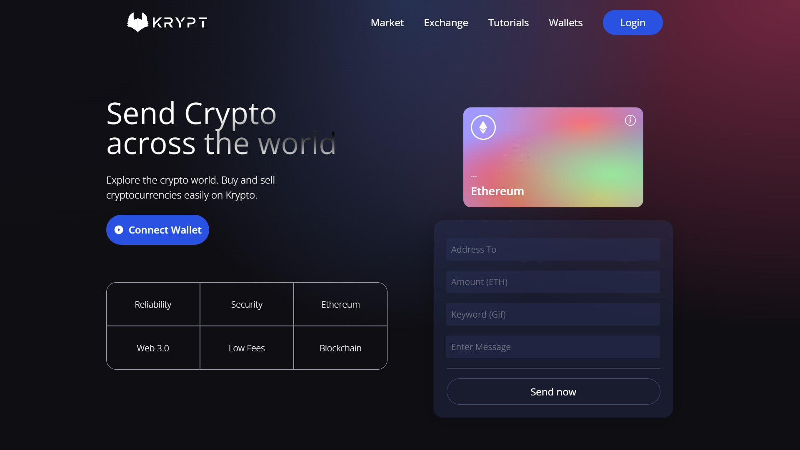

# Krypt - A Web 3.0 Blockchain Application 

## Introduction
Krypt is a blockchain application built using Web 3.0 methodologies, Solidity and Metamask that enables transaction of ethers between MeteMask accounts.

## Working
The user have to connect the application to the metamask account by clicking the connect wallet button. After connection, the user can send ethers to any metamask account across the globe in the same ethereum network. The user can also view his previous transactions.

Link to deployed application - https://krypt-deployment.vercel.app/

## Tools used
* Frontend development : ReactJS, Tailwind CSS
* Smart Contract Programming Language : Solidity
* IDE : Visual Studio Code
* Version Control : GitHub
* Others : Google Chrome, MetaMask

